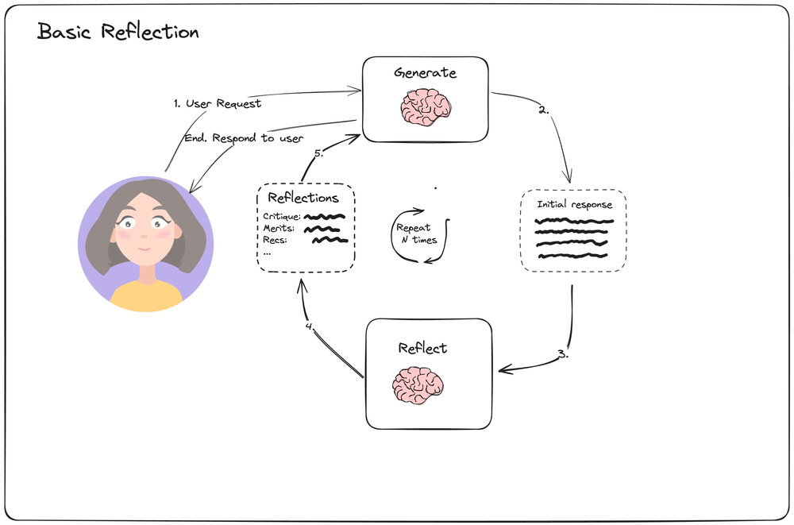

The main 4 Agentic design patterns:
1. Reflection Pattern
2. Tool Pattern
3. Planning Pattern
4. Multi-Agent Pattern

## 1. Reflection pattern

* A `reflection` agent pattern is an AI system pattern that can look at its own outputs and think about them / make it better - just like how we look at ourselves in a mirror and self-reflect, make ourselfs better.

* In this pattern, we have 2 main agents, one act as `generator` and other act as `reflectore` that criticizes the responses from the generator and suggests constructive feedback.

-

* The `generate` agent generates answers to user queries. 
* The generated response(Initial response) will be passed on to `reflect` agent to reflect on it and give us constructive feedback.
* The constructive feedback will then be passed on the `generator` agent to fine tune its initial response.
* This will be in loop for `N` number of times.

There are 3 types of Reflection Agents:

    a. Basic Reflection Agents
    b. Reflexion Agents
    c. Language Agent Tree Search (LATS)